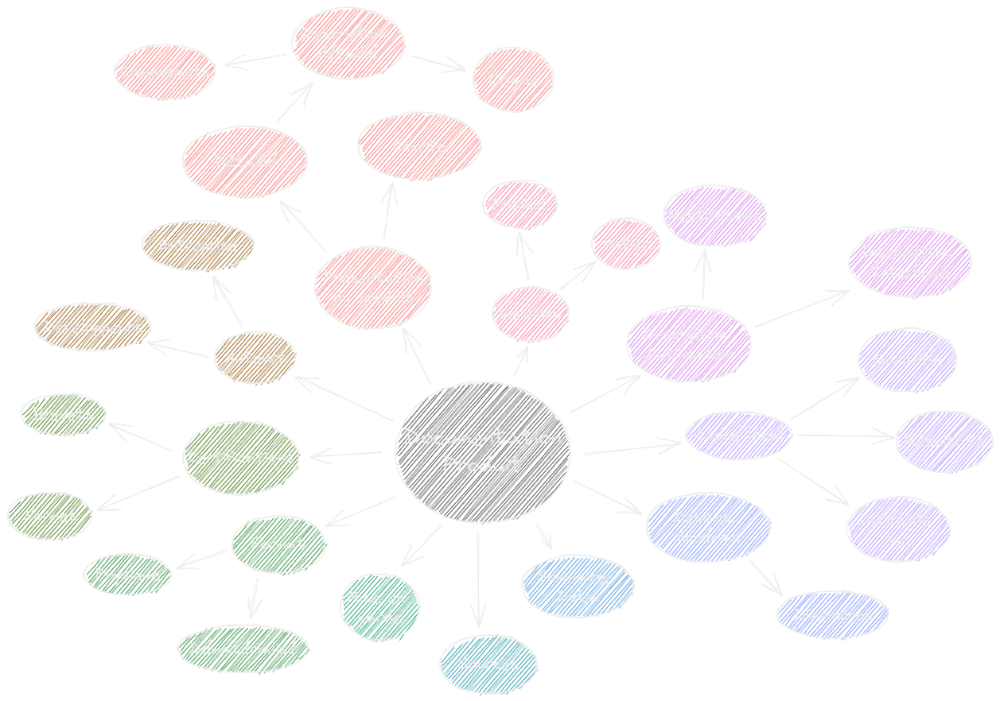
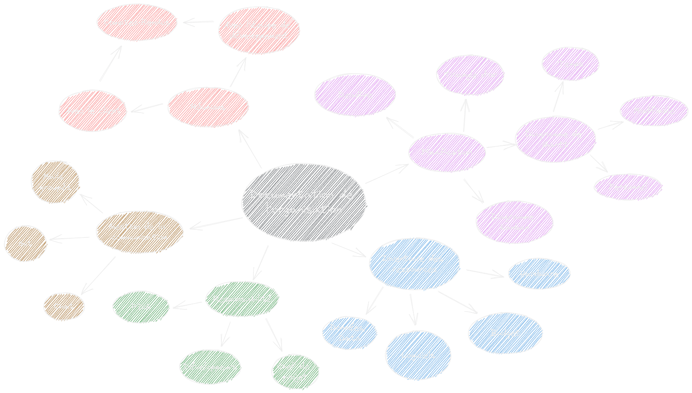
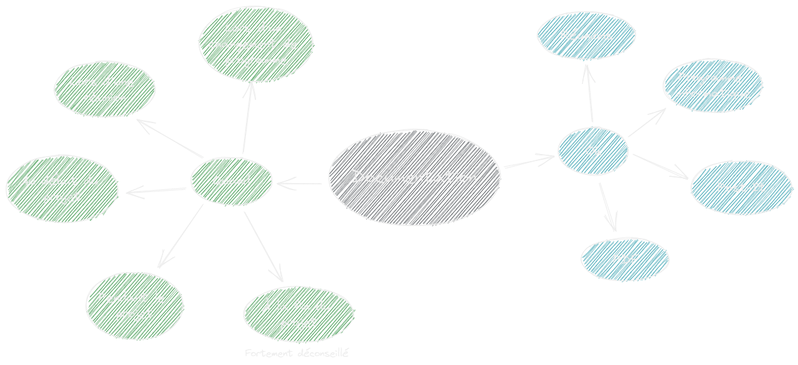

# Bibliographie

Ce document à pour but de rassembler toute les sources qui ont été utiles lors de la réflexion et du développement du projet ***Agriculture Urbaine***.

## Carte mentale résumant une documentation produit

## Carte mentale résumant la documentation de l'organisation

## Carte mentale résumant quand et où une documentation doit être produite

### Liens utiles pour démarrer ses recherches

- [SciHub](https://sci-hub.se)

## Bibliographie d'Etude

- [Exemple](https://www.youtube.com/watch?v=dQw4w9WgXcQ)

## Bibliographie Technique

- [Comparatif des différents capteurs de Température](https://github.com/TeteNeuvyAlexandre/Projet-Agriculture-Urbaine/blob/main/Bibliographie/TableauCapteursTemperature.md) (effectué par BEN GHORBEL Bayrem),
- [Comparatif des différents capteurs de Luminosité](https://github.com/TeteNeuvyAlexandre/Projet-Agriculture-Urbaine/blob/main/Bibliographie/TableauCapteursLuminosite.md) (effectué par CHAMPOMMIER Yann),
- [Comparatif des différents capteurs d'humidité du sol](https://github.com/TeteNeuvyAlexandre/Projet-Agriculture-Urbaine/blob/main/Bibliographie/TableauCapteursHumiditeSol.md) (effectué par KARBOUL Olfa),
- [Comparatif des différents microcontrôleurs](https://github.com/TeteNeuvyAlexandre/Projet-Agriculture-Urbaine/blob/main/Bibliographie/TableauMicrocontroleurs.md) (effectué par TÊTE-NEUVY Alexandre),
- [Comparatif des différents écrans](https://github.com/TeteNeuvyAlexandre/Projet-Agriculture-Urbaine/blob/main/Bibliographie/TableauEcrans.md) (effectué par TÊTE-NEUVY Alexandre).

- [Exemple d'un système de suivi d'une plante](https://www.pearl.fr/article/ZX2807/capteur-de-croissance-pour-plantes-sun-141-controle-par-application)

### [Retour à la page d'accueil](https://github.com/TeteNeuvyAlexandre/Projet-Agriculture-Urbaine)