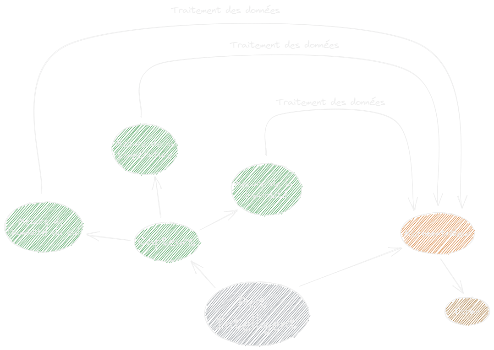

# Projet Agriculture Urbaine

Il s'agit d'un repertoire permettant de centraliser et d'échanger l'avancé des travaux sur le projet du groupe 9 composé de BEN GHORBEL Bayrem, CHAMPOMMIER Yann, KARBOUL Olfa et TÊTE-NEUVY Alexandre.
Ce projet à pour thème ***l'Agriculture Urbaine*** avec les problématiques suivantes, choisit par le groupe :

- Surveillance et suivi d'une plante dans le but d'optimiser sa gestion,
- Auto-gestion d'une plante sans intervention humaine,
- Surveillance de l'impact de la pollution sur le rendement d'une recolte en milieu urbain,
- Gestion et optimisation de l'espace pour une agriculture urbaine,
- Renseignments sur les besoins d'une plante en milieu urbain,
- Gestion et optimisation de l'eau en milieu urbain (lors de restrictions estivales),
- Gestion de la polénisation en milieu urbain.

## Carte Mentale effectué par les différents groupes sur le thème ***Agriculture Urbaine***

## Diagramme *"Bête à Cornes"* effectué par le groupe

## Diagramme synthétique de l'objet répondant à la problématiques

## Liens utiles à la navigations du répertoire

- **[Cahier de Bord](https://github.com/TeteNeuvyAlexandre/Projet-Agriculture-Urbaine/blob/main/Cahier-de-Bord/CahierDeBord.md)**
- **[Consignes sur la Présentation Oral](https://github.com/TeteNeuvyAlexandre/Projet-Agriculture-Urbaine/blob/main/Presentation-Oral/ConsignesPresentationOral.md)**
- **[Bibliographie](https://github.com/TeteNeuvyAlexandre/Projet-Agriculture-Urbaine/blob/main/Bibliographie/Bibliographie.md)**
