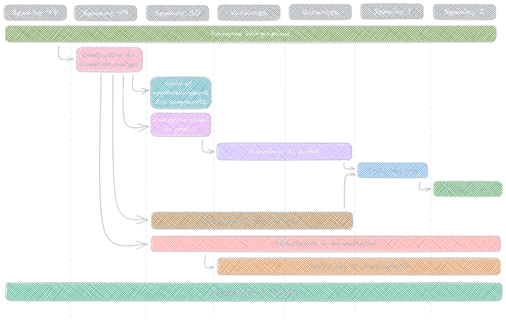

# Projet Agriculture Urbaine

Il s'agit d'un repertoire permettant de centraliser et d'échanger l'avancé des travaux sur le projet du groupe 9 composé de BEN GHORBEL Bayrem, CHAMPOMMIER Yann, KARBOUL Olfa et TÊTE-NEUVY Alexandre.
Ce projet à pour thème ***l'Agriculture Urbaine*** avec les problématiques suivantes, choisit par le groupe :

- Surveillance et suivi d'une plante dans le but d'optimiser sa gestion,
- Auto-gestion d'une plante sans intervention humaine,
- Surveillance de l'impact de la pollution sur le rendement d'une recolte en milieu urbain,
- Gestion et optimisation de l'espace pour une agriculture urbaine,
- Renseignments sur les besoins d'une plante en milieu urbain,
- Gestion et optimisation de l'eau en milieu urbain (lors de restrictions estivales),
- Gestion de la polénisation en milieu urbain.

## Carte Mentale effectué par les différents groupes sur le thème ***Agriculture Urbaine***

## Diagramme *"Bête à Cornes"* effectué par le groupe

## Cahier des charges du produit

- Le produit doit être capable de mesurer trois grandeurs physiques pour surveiller le développement d'une plantes entregeistrer dans la base de donnée du produit. Ces trois grandeurs sont :
	- La luminosité ambiante
	- La température ambiante
	- L'humidité du sol 
- Les capteurs fonctionnerons de la manières suivante : 
	- Le capteur de luminosité utilisera la technologie des photoresistances. On utilisera un pont diviseur de tension (ou pont de Wheatstone) pour mesurer la résistance de la photorésistance.
	- Le capteur de température utilisera la technologie des thermistances. On utilisera un pont diviseur de tension (ou pont de Wheatstone) pour mesurer la résistance de la thermistance.
	- Le capteur d'humidité du sol utilisera la conductivité relative d'un sol humide. On utilisera un pont diviseur de tension (ou pont de Wheatstone) pour mesurer la résistance fictive du sol humide.
- Un microcontroleur sera nécessaire pour receptionner et communiquer les mesures à l'utilisateur :
	- Les tensions de sortie des capteurs devront être traitées et traduites / converties en leurs grandeurs physiques réelles par un microcontrôleur.
	- Le microcontrôleur dispose d'une base de données sur la gestion (paramètres optimaux) de différentes plantes pour accompagner l'utilisateur sur la croissance de la plante (on choisira un type de plante pour l'essai final).
	- L'écran LCD relié au microcontroleur communiquera les grandeurs de la manière suivante :
		- La température devra être communiqué en degré Celcius et un commentaire devra être transmis à l'utilisateur sur la gestion de la plante par rapport à la donnée de reference (ou allumage d'une LED).
		- L'humidité de sol devra être communiqué en porcentage et un commentaire devra être transmis à l'utilisateur sur la gestion de la plante par rapport à la donnée de reference (ou allumage d'une LED).
		- La luminosité instentané devra être communiqué en candela et et un commentaire devra être transmis à l'utilisateur sur la gestion de la plante par rapport à la donnée de reference (ou allumage d'une LED).
		- La luminosité moyenne devra être communiqué en candela et et un commentaire devra être transmis à l'utilisateur sur la gestion de la plante par rapport à la donnée de reference (ou allumage d'une LED).
	- Le traitement des données de chaque capteur devra être fait de préférence en paralèlles via un "Protothreading" afin d'aider l'utilisateur à trouver l'emplecement optimal pour la plante, sinon en série.
- L'utilisateur pourra agir suite aux indications du produit.
- Le dispositif devra être autonome en énergie : (facultatif)
	- Le produit sera alimenté par une batterie pouvant tenir la journée.
	- La batterie devra être rechargée par une cellule photovoltaïque.

## Diagramme de Gantt résumant l'avancée des travaux

## Liens utiles à la navigations du répertoire

- **[Cahier de Bord](https://github.com/TeteNeuvyAlexandre/Projet-Agriculture-Urbaine/blob/main/Cahier-de-Bord/CahierDeBord.md)**
- **[Consignes sur la Présentation Oral](https://github.com/TeteNeuvyAlexandre/Projet-Agriculture-Urbaine/blob/main/Presentation-Oral/ConsignesPresentationOral.md)**
- **[Bibliographie](https://github.com/TeteNeuvyAlexandre/Projet-Agriculture-Urbaine/blob/main/Bibliographie/Bibliographie.md)**
